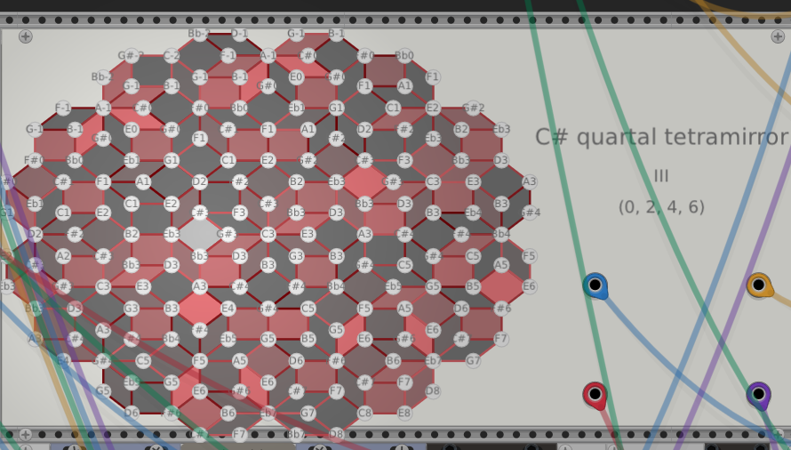

## Am-VcV

Experiments with a 4d generalization of the Reimannian tonnetz in vcv-rack as a playable interface.  Chord chroma represents degrees of consonance from the current chord using a diatonic-weighted variant of a tonal interval space. 



### Faust Pulsar Voice

`examples/pulsar_voice.dsp` is a Faust implementation of a pulsar-synthesis
voice. All sculpting controls expose matching CV sockets (`Pitch`, `Pulse Width`,
`Pulse Jitter`, `Output Level`, Width Compensation, Env Mix, Internal Wave
Level/Morph, Channel Position/Map Mix/Spread), so the Rack template allocates
dedicated inputs automatically. The module expects an audio-rate waveform on its
first input, an optional envelope/audio modulator on the second, and a third
audio/CV input sampled at each grain reset to select the output-channel
placement. Four audio outputs carry the grain energy; with `Channel Spread` set
to zero the grains crossfade between neighbours, otherwise they distribute
across all four channels.

Two scripts manage the workflow:

- `scripts/generate_faust_vcv.py <file.dsp>` runs `faust2vcvrack -source` and
  emits a Rack plugin skeleton (Makefile, C++ sources, resources). Pass
  `--force` to overwrite an existing folder or `--voices N` to generate a
  polyphonic version.
- `scripts/build_vcv_component.py <plugin-folder>` invokes Rack’s Makefile to
  build the module, produces a `.vcvplugin` under `build/faust/`, and installs
  it into your user plugin directory (override with `$RACK_PLUGIN_DIR` if
  needed).

The convenience wrapper remains available:

```
devenv shell
devenv run build-faust              # regenerates + builds pulsar_voice.dsp
devenv run build-faust path/to/foo.dsp --voices 4  # forwards args to the generator
```

`build-faust` now calls the two scripts sequentially. After the build stage, the
`.vcvplugin` lands in `build/faust/` and is extracted into your Rack plugin
directory (preferring `$RACK_PLUGIN_DIR`, then `$RACK_USER_DIR/plugins`, and
finally `~/Library/Application Support/Rack2/plugins-mac-arm64`, with a fallback
to `~/Documents/Rack2/plugins`).
The wrapper passes `--force` to the generator, so any existing generated source
folder is replaced; if you want to keep manual tweaks, invoke
`scripts/build_vcv_component.py` directly without regenerating.
